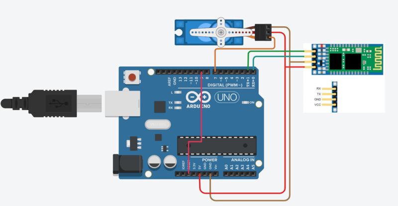

# A python script to send data to Arduino using a game pad controller

This is a demo on how you can use your game controller to send data to arduino using bluetooth module. I wrote a python script to communicate with bluetooth module and gamepad. There's an **arduino sketch** that processes the incoming data and controls a servo. You can use that as reference to control more devices and motors with gamepad/joystick.

## Packages used:

You need to have a **python interpreter** and **arduino IDE** installed on your local PC.

1. pygame
2. pybluez

## Steps:

1. Open `bt.py`. Add your bluetooth module's MAC address to bd_addr variable.

```py
bd_addr = "YOUR BLUETOOTH MODULE'S MAC ADDRESS"
```

2. To check your gamepad's button output, Connect your game pad. Run `gp.py` from your terminal.

```
python3 gp.py
```

Check your terminal and press all the buttons one by one to see the Output. 3. Change the `main.py` variables based on your gamepad's output. 4. Upload the `arduino/sketch.py` in your Arduino board. Here's a schematic of the arduino.



5. Power your arduino. Run the `main.py` from the terminal. That's all. Now check the **Serial monitor** and enjoy the show.

## Contributing

Contributions are what make the open source community such an amazing place to be learn, inspire, and create. Any contributions you make are greatly appreciated.
If you have any suggestions or issues feel free to open an issue.

## Contact

If you face any problem or have any query feel free to contact me.
